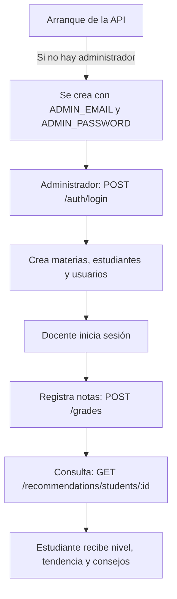
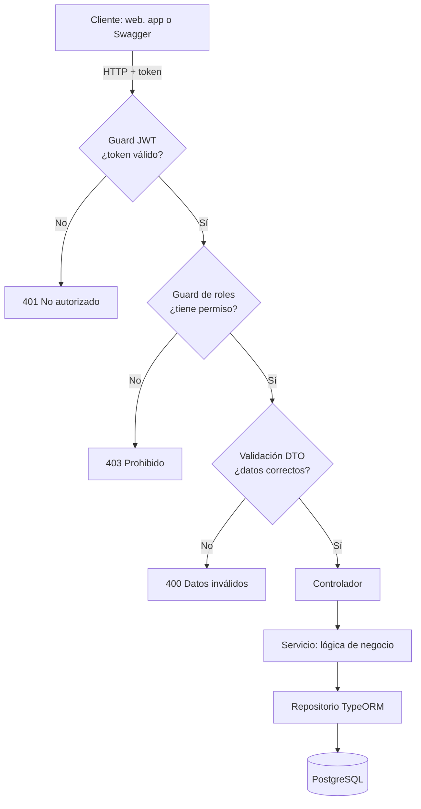
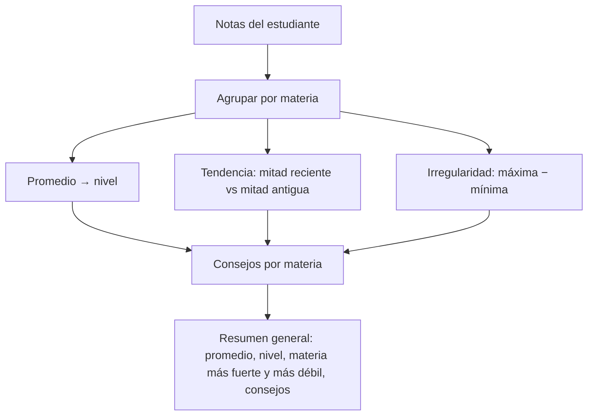
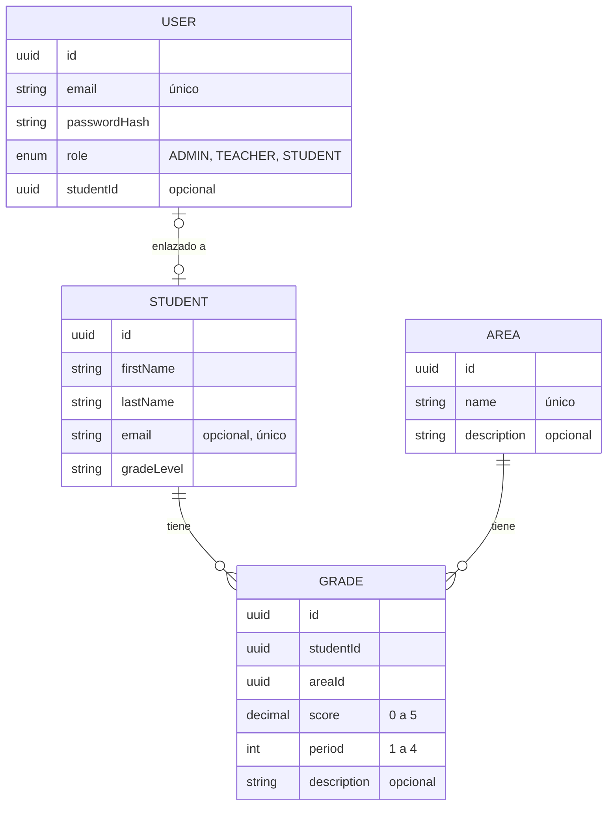

# Learn Better API

API de seguimiento académico que guarda las notas de los estudiantes y, a partir de ellas, genera un **diagnóstico y recomendaciones de estudio personalizadas**.

Construida con **NestJS**, **TypeScript**, **PostgreSQL** y autenticación con **JWT**.

---

## Tabla de contenido

- [¿Qué hace?](#qué-hace)
- [Tecnologías](#tecnologías)
- [Requisitos](#requisitos)
- [Instalación](#instalación)
- [Variables de entorno](#variables-de-entorno)
- [Cómo se usa](#cómo-se-usa)
- [Arquitectura](#arquitectura)
- [Roles y permisos](#roles-y-permisos)
- [Rutas de la API](#rutas-de-la-api)
- [Cómo se calculan las recomendaciones](#cómo-se-calculan-las-recomendaciones)
- [Modelo de datos](#modelo-de-datos)
- [Estructura del proyecto](#estructura-del-proyecto)
- [Scripts disponibles](#scripts-disponibles)
- [Pruebas](#pruebas)
- [Flujo de trabajo con Git](#flujo-de-trabajo-con-git)
- [Estado del proyecto](#estado-del-proyecto)

---

## ¿Qué hace?

| Módulo | Descripción |
|---|---|
| **Estudiantes** | Registrar, consultar, editar y borrar alumnos. |
| **Materias** | Registrar, consultar, editar y borrar las áreas que se evalúan. |
| **Notas** | Registrar notas de **0 a 5** por periodo (**1 a 4**), con filtros por estudiante, materia y periodo. |
| **Recomendaciones** | Analizar las notas y devolver nivel, tendencia, materia más fuerte y más débil, y consejos de estudio. |
| **Autenticación** | Inicio de sesión con token y permisos según el rol del usuario. |

---

## Tecnologías

- [NestJS](https://nestjs.com/) + TypeScript
- PostgreSQL + TypeORM (con migraciones)
- JWT + Passport + bcrypt
- class-validator para validar los datos
- Swagger para la documentación interactiva
- Jest para las pruebas
- Docker Compose para la base de datos local

---

## Requisitos

- Node.js 20 o superior
- npm
- Docker Desktop
- Git

---

## Instalación

```bash
# 1. Clonar el repositorio
git clone https://github.com/Andres-Maya/learn-better_API.git
cd learn-better_API

# 2. Instalar dependencias
npm install

# 3. Crear el archivo de variables de entorno
cp .env.example .env
# Edita .env con tus valores

# 4. Levantar PostgreSQL
docker compose up -d

# 5. Crear las tablas
npm run migration:run

# 6. Iniciar la API en modo desarrollo
npm run start:dev
```

- API: `http://localhost:3000`
- Documentación Swagger: `http://localhost:3000/docs`

---

## Variables de entorno

| Variable | Descripción | Ejemplo |
|---|---|---|
| `PORT` | Puerto de la API | `3000` |
| `DB_HOST` | Servidor de la base de datos | `localhost` |
| `DB_PORT` | Puerto de PostgreSQL | `5432` |
| `DB_USER` | Usuario de la base de datos | `postgres` |
| `DB_PASSWORD` | Contraseña de la base de datos | `postgres` |
| `DB_NAME` | Nombre de la base de datos | `learn_better` |
| `JWT_SECRET` | Clave para firmar los tokens | `una-clave-larga-y-secreta` |
| `JWT_EXPIRES_IN` | Duración del token | `1d` |
| `ADMIN_EMAIL` | Correo del administrador inicial | `admin@colegio.edu.co` |
| `ADMIN_PASSWORD` | Contraseña del administrador inicial | `CambiaEsto123` |

> El archivo `.env` no se sube al repositorio. Usa `.env.example` como guía.

---

## Cómo se usa



1. **Arranque:** si no existe un administrador, se crea automáticamente con los datos del `.env`.
2. **Inicio de sesión:** `POST /auth/login` devuelve un token. Envíalo en cada petición:
   `Authorization: Bearer <token>`
3. **Preparación:** el administrador crea materias, estudiantes y usuarios (docentes y estudiantes).
4. **Registro de notas:** el docente registra las notas por materia y periodo.
5. **Recomendaciones:** se consultan en cualquier momento y se recalculan con las notas actuales.

### Probar desde Swagger

1. Abre `http://localhost:3000/docs`.
2. Ejecuta `POST /auth/login` con el correo y la contraseña del administrador.
3. Copia el `accessToken` de la respuesta.
4. Haz clic en **Authorize**, pega el token y confirma.
5. Ya puedes probar las rutas protegidas.

---

## Arquitectura

Cada petición pasa por estas capas antes de llegar a la base de datos:



| Código | Cuándo ocurre |
|---|---|
| `400` | Los datos enviados no son válidos. |
| `401` | No se envió token o no es válido. |
| `403` | El rol del usuario no tiene permiso. |
| `404` | El recurso no existe. |
| `409` | Dato duplicado (nombre de materia o correo). |

---

## Roles y permisos

| Acción | ADMIN | TEACHER | STUDENT |
|---|:-:|:-:|:-:|
| Crear, editar o borrar estudiantes y materias | ✅ | ❌ | ❌ |
| Ver estudiantes y materias | ✅ | ✅ | ❌ |
| Crear, editar o borrar notas | ✅ | ✅ | ❌ |
| Ver notas | ✅ | ✅ | Solo las suyas |
| Ver recomendaciones | ✅ | ✅ | Solo las suyas |
| Crear usuarios | ✅ | ❌ | ❌ |

Rutas públicas, sin token: `POST /auth/login` y `GET /`.

---

## Rutas de la API

### Autenticación

| Método | Ruta | Descripción | Roles |
|---|---|---|---|
| `POST` | `/auth/login` | Inicia sesión y devuelve el token | Público |
| `GET` | `/auth/me` | Datos del usuario actual | Todos |
| `POST` | `/auth/register` | Crea un usuario | ADMIN |

### Estudiantes

| Método | Ruta | Descripción | Roles |
|---|---|---|---|
| `GET` | `/students` | Lista los estudiantes | ADMIN, TEACHER |
| `GET` | `/students/:id` | Muestra un estudiante | ADMIN, TEACHER |
| `POST` | `/students` | Crea un estudiante | ADMIN |
| `PATCH` | `/students/:id` | Edita un estudiante | ADMIN |
| `DELETE` | `/students/:id` | Borra un estudiante y sus notas | ADMIN |

### Materias

| Método | Ruta | Descripción | Roles |
|---|---|---|---|
| `GET` | `/areas` | Lista las materias | ADMIN, TEACHER |
| `GET` | `/areas/:id` | Muestra una materia | ADMIN, TEACHER |
| `POST` | `/areas` | Crea una materia | ADMIN |
| `PATCH` | `/areas/:id` | Edita una materia | ADMIN |
| `DELETE` | `/areas/:id` | Borra una materia y sus notas | ADMIN |

### Notas

| Método | Ruta | Descripción | Roles |
|---|---|---|---|
| `GET` | `/grades?studentId=&areaId=&period=` | Lista notas con filtros opcionales | Todos* |
| `GET` | `/grades/:id` | Muestra una nota | Todos* |
| `POST` | `/grades` | Registra una nota | ADMIN, TEACHER |
| `PATCH` | `/grades/:id` | Edita una nota | ADMIN, TEACHER |
| `DELETE` | `/grades/:id` | Borra una nota | ADMIN, TEACHER |

### Recomendaciones

| Método | Ruta | Descripción | Roles |
|---|---|---|---|
| `GET` | `/recommendations/students/:studentId` | Análisis general del estudiante | Todos* |
| `GET` | `/recommendations/students/:studentId/areas/:areaId` | Análisis en una materia | Todos* |

\* Un usuario `STUDENT` solo puede ver sus propias notas y recomendaciones.

### Ejemplo: registrar una nota

```http
POST /grades
Authorization: Bearer <token>
Content-Type: application/json

{
  "studentId": "3f6c1d2a-8b4e-4c1a-9f2d-1a2b3c4d5e6f",
  "areaId": "7a8b9c0d-1e2f-4a3b-8c4d-5e6f7a8b9c0d",
  "score": 4.2,
  "period": 2,
  "description": "Evaluación de fracciones"
}
```

---

## Cómo se calculan las recomendaciones



### Niveles

| Nivel | Promedio |
|---|---|
| 🔴 **BAJO** | menos de 3.0 |
| 🟠 **BÁSICO** | 3.0 a 3.9 |
| 🔵 **ALTO** | 4.0 a 4.5 |
| 🟢 **SUPERIOR** | 4.6 o más |

### Tendencia

Las notas se ordenan por periodo y se compara el promedio de la mitad más reciente con el de la mitad más antigua:

| Tendencia | Condición |
|---|---|
| **MEJORANDO** | La diferencia es de +0.3 o más |
| **BAJANDO** | La diferencia es de −0.3 o menos |
| **ESTABLE** | Cualquier otro caso |
| **SIN_DATOS_SUFICIENTES** | Solo hay una nota |

### Irregularidad

Si la diferencia entre la nota más alta y la más baja de una materia es **1.5 o más**, se recomienda un horario fijo de estudio.

### Ejemplo de respuesta

```json
{
  "studentId": "3f6c1d2a-8b4e-4c1a-9f2d-1a2b3c4d5e6f",
  "studentName": "Laura Gómez",
  "overallAverage": 3.65,
  "level": "BASICO",
  "strongestArea": "Inglés",
  "weakestArea": "Matemáticas",
  "areas": [
    {
      "areaName": "Matemáticas",
      "average": 2.8,
      "highestScore": 3.5,
      "lowestScore": 2.0,
      "gradesCount": 3,
      "level": "BAJO",
      "trend": "MEJORANDO",
      "recommendations": ["..."]
    }
  ],
  "generalRecommendations": ["..."]
}
```

---

## Modelo de datos



- Todas las tablas tienen `createdAt` y `updatedAt`.
- Al borrar un estudiante o una materia, se borran sus notas.

---

## Estructura del proyecto

```text
src/
├── auth/              Login, token, guards y decoradores (@Public, @Roles)
├── users/             Usuarios y roles
├── students/          Estudiantes
├── areas/             Materias
├── grades/            Notas y escala de calificación
├── recommendations/   Análisis y consejos
└── main.ts            Arranque de la app y Swagger
test/                  Pruebas e2e
```

Cada módulo sigue el mismo patrón:

- **Controlador:** define las rutas.
- **Servicio:** contiene la lógica.
- **Entidad:** representa la tabla en la base de datos.
- **DTO:** valida los datos que llegan.

---

## Scripts disponibles

| Comando | Descripción |
|---|---|
| `npm run start:dev` | Inicia en modo desarrollo con recarga automática |
| `npm run start:prod` | Inicia en modo producción |
| `npm run build` | Compila el proyecto |
| `npm run test` | Ejecuta las pruebas unitarias |
| `npm run test:cov` | Pruebas con reporte de cobertura |
| `npm run migration:generate` | Genera una migración a partir de los cambios en las entidades |
| `npm run migration:run` | Aplica las migraciones pendientes |
| `npm run migration:revert` | Revierte la última migración |

---

## Pruebas

```bash
npm run test       # pruebas unitarias
npm run test:cov   # cobertura
```

Se prueban principalmente:

- Cálculo de niveles en los bordes (2.99, 3, 4 y 4.6).
- Tendencia: mejorando, bajando, estable y con una sola nota.
- Detección de irregularidad.
- Registro de notas y errores 404.
- Inicio de sesión y permisos por rol.

---

## Flujo de trabajo con Git

- No se trabaja directamente en `main`.
- Cada mejora se desarrolla en su propia rama y se une mediante Pull Request.
- Commits pequeños con el formato `tipo: descripción`.

| Tipo | Uso |
|---|---|
| `feat` | Nueva funcionalidad |
| `fix` | Corrección de errores |
| `refactor` | Cambio de código sin cambiar el comportamiento |
| `test` | Pruebas |
| `docs` | Documentación |
| `chore` | Configuración y dependencias |

Ejemplo: `feat: entidad Student con typeorm`

---

## Estado del proyecto

### ✅ Implementado

- CRUD de estudiantes, materias y notas
- Recomendaciones personalizadas
- PostgreSQL con migraciones
- Documentación con Swagger
- Inicio de sesión con JWT y roles
- Pruebas unitarias principales

### 🚧 Próximos pasos

- [ ] Paginación y búsqueda
- [ ] Reporte por grado
- [ ] Datos de ejemplo (seed)
- [ ] Health check
- [ ] Helmet y límite de peticiones
- [ ] Filtro global de errores
- [ ] Refresh token y cambio de contraseña
- [ ] Editar y borrar usuarios
- [ ] Pruebas e2e
- [ ] Dockerfile de producción

---

## Autor

**Andrés Maya** · [GitHub](https://github.com/Andres-Maya)
